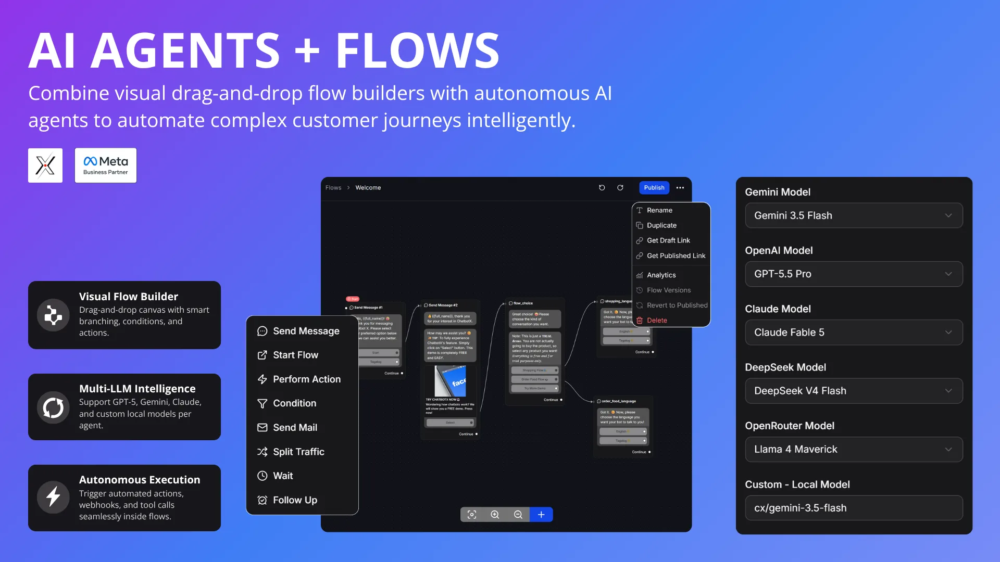
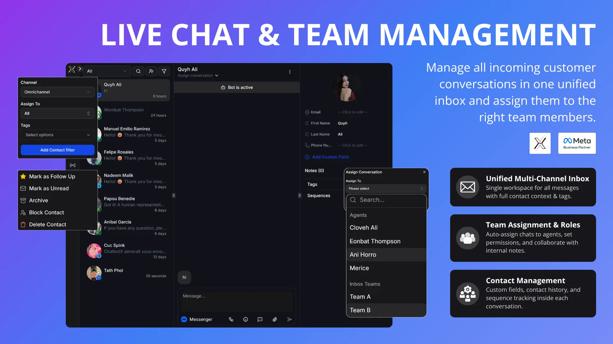
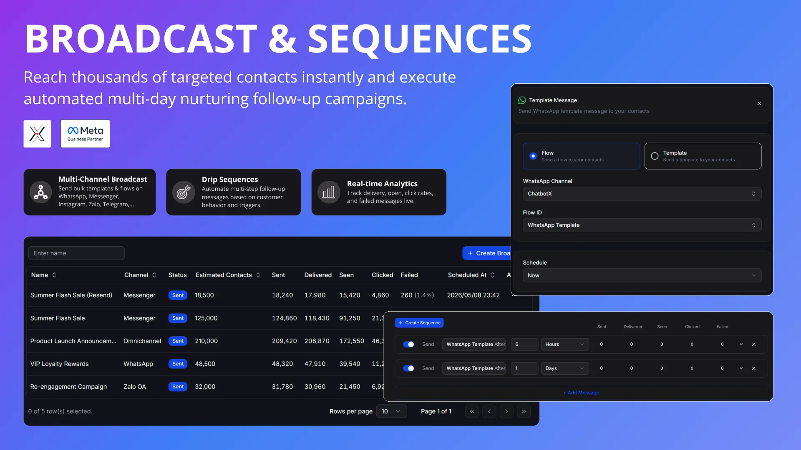
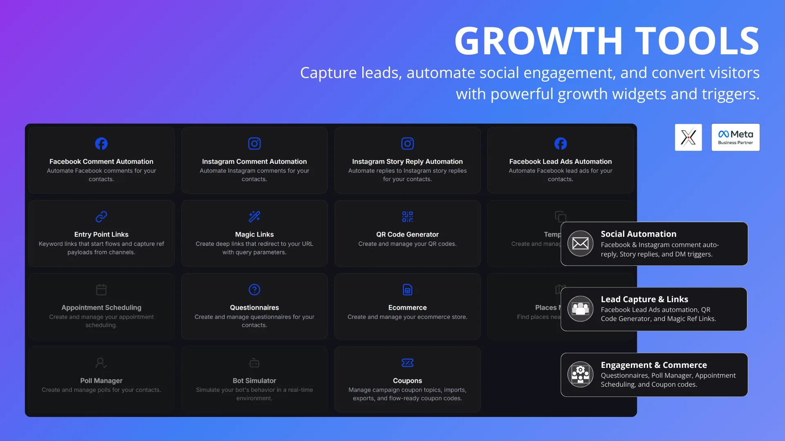
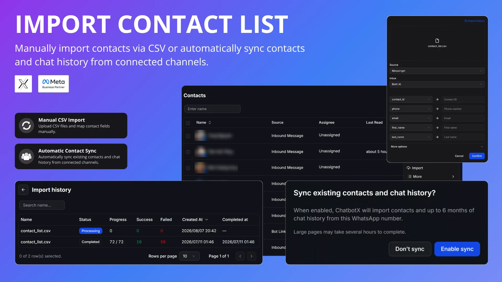
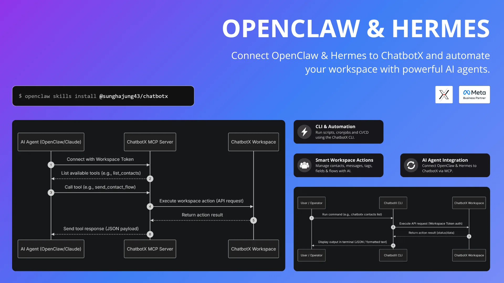

<p align="center">
  <a href="https://github.com/ChatbotXIO/ChatbotX" target="_blank" rel="noopener">
    <picture>
      <source media="(prefers-color-scheme: dark)" srcset=".github/assets/readme/chatbotx-logo-dark.svg">
      <source media="(prefers-color-scheme: light)" srcset=".github/assets/readme/chatbotx-logo-light.svg">
      
    </picture>
  </a>
</p>

<p align="center">
  <a href="https://opensource.org/license/mit">
    
  </a>
</p>

<p align="center">
  <strong>Agentic chat marketing platform built for OpenClaw, Hermes, and Claude</strong>
  <br>
  An alternative to ManyChat, Chatfuel, Wati, Respond, etc...
</p>

<p align="center">
  <a href="https://chatbotx.io/">Website</a>
  |
  <a href="https://chatbotx.canny.io/">Roadmap</a>
  |
  <a href="https://chatbotx.io/docs" rel="dofollow">Docs</a>
  |
  <a href="https://discord.chatbotx.io/">Discord</a>
  |
  <a href="https://www.g2.com/products/chatbotx/take_survey" target="_blank" rel="dofollow">View G2 Reviews</a>
</p>

<p align="center">
  
  
  
  
  
  
  
  
</p>

<p align="center">
  
  
  
  
  
  <picture>
    <source media="(prefers-color-scheme: dark)" srcset=".github/assets/readme/tiktok-dark.svg">
    <source media="(prefers-color-scheme: light)" srcset=".github/assets/readme/tiktok-light.svg">
    
  </picture>
  
  
</p>

<p align="center">
  <a href="https://youtube.com/@chatbotxofficial" rel="dofollow"><strong>Watch the YouTube Tutorials»</strong></a>
  <br />
</p>

<p align="center">
  <a href="https://app.chatbotx.io">Register</a>
  ·
  <a href="https://chatbotx.io/docs/cli/introduction">CLI</a>
  ·
  <a href="https://chatbotx.io/docs/mcp/introduction">MCP</a>
  ·
  <a href="https://chatbotx.io/docs/api-reference/api-overview">Public API</a><br />
</p>

<p align="center">
  <a href="https://www.youtube.com/watch?v=b1NUlA-fIzw" target="_blank">
    
  </a>
</p>

## ✨ Features

- **Omnichannel:** WhatsApp, Facebook, Instagram, TikTok, Telegram, Zalo, Email, API, and Webchat
- **Visual Flow Builder:** Drag-and-drop chatbot builder with 15+ node types
- **AI Agents:** OpenAI, Claude, Gemini, DeepSeek, OpenRouter, NVIDIA NIM, and Local LLMs
- **Live Chat Inbox:** Real-time inbox with human takeover and conversation assignment
- **Contact CRM:** Manage contacts with tags, custom fields, and segmentation
- **Broadcasting:** Send targeted messages to specific contact segments
- **Sequences:** Automate drip campaigns with scheduled messages and auto-enrollment
- **Team Management:** Invite team members, assign roles, and manage permissions
- **Rich Messaging:** Media, files, buttons, quick replies, catalogs, locations, and carousel cards
- **Comment-to-DM:** Automatically message users who comment with specific keywords
- **A/B Testing:** Test and optimize different message flows
- **Triggers:** Execute actions based on events within your bot
- **Webhooks & HTTP:** Integrate external APIs directly into your flows
- **Growth Tools:** Create engaging minigames and interactive experiences
- **Analytics:** Track performance metrics, user engagement, and campaign results
- **APIs, CLI, and MCP:** Build advanced agent workflows with MCP-compatible clients

|  |  |
| ------------------------------------------------------------------------------------------- | ------------------------------------------------------------------------------------------- |
|  |  |
|  |  |

## Why ChatbotX?

| Feature | ManyChat | ChatbotX |
|---|---:|---:|
| Self-Hosted | ❌ | ✅ |
| White Label | ❌ | ✅ |
| CLI & MCP | ❌ | ✅ |
| Cost Growth | ✅ | ❌ |
| Public API | Limited | ✅ |
| Omnichannel | Limited | ✅ |
| AI Agents | Limited | ✅ |
| AI Credits | Add-on | BYOK |

## Tech Stack

- Node.js 24
- TypeScript 5
- pnpm 10 workspaces
- Turborepo
- Next.js 16 and React 19 for `apps/builder`
- PartyKit / PartySocket for realtime messaging
- Drizzle ORM with PostgreSQL and pgvector
- Redis and BullMQ for queues and worker coordination
- RustFS / S3-compatible storage for uploaded assets
- Docker Compose for local infrastructure

## Quick Start

To have the project up and running, please follow the [Quick Start Guide](https://chatbotx.io/docs/quickstart).

## Project Structure

```text
.
|-- apps/
|   |-- builder/       # Next.js web app and product builder
|   |-- worker/        # background workers for chat, AI, triggers, webhooks, analytics, sequences
|   |-- realtime/      # realtime server
|   |-- cli/           # ChatbotX command line client
|   `-- mcp-server/    # MCP server backed by public APIs
|-- integrations/
|   |-- whatsapp/
|   |-- messenger/
|   |-- instagram/
|   |-- telegram/
|   |-- zalo/
|   |-- tiktok/
|   |-- webchat/
|   |-- smtp/
|   |-- openai/
|   |-- google-sheets/
|   `-- ...           # email/CRM: mailchimp, klaviyo, active-campaign, drip, get-response, mailer-lite, moosend, sendgrid
|-- packages/
|   |-- database/
|   |-- ai/
|   |-- auth/
|   |-- business/
|   |-- automated-response/
|   |-- analytics/
|   |-- event-bus/
|   |-- mail/
|   |-- imports/
|   |-- flow-config/
|   |-- variables/
|   |-- sdk/
|   |-- scheduler/
|   |-- sequence-scheduler/
|   |-- ui/
|   `-- worker-config/
|-- docker-compose.yml
|-- pnpm-workspace.yaml
`-- turbo.json
```

## Development Commands

```bash
pnpm dev              # run turbo dev
pnpm build            # build all packages/apps through Turborepo
pnpm lint             # run Ultracite lint
pnpm fix              # run Ultracite fix
pnpm check:circular   # check circular dependencies
pnpm check:unused     # check unused files and dependencies
```

Useful package-level commands:

```bash
pnpm --filter builder dev
pnpm --filter worker dev
pnpm --filter realtime dev
pnpm --filter chatbotx-cli dev:cli
pnpm --filter chatbotx-mcp-server dev:mcp
pnpm --filter @chatbotx.io/database db:studio
```

## Services

The default Docker Compose stack includes:

- PostgreSQL with pgvector on `5432`
- Redis on `6379`
- RedisInsight on `5540`
- RustFS object storage on `9000` and console on `9001`
- MailHog SMTP on `1025` and UI on `8025`
- Adminer on `8080`

## Support

If ChatbotX helps you avoid expensive chatbot automation tools, please give us a ⭐ on GitHub.
We're also working hard to bring open-source mobile apps to **iOS and Android** this year

## License

ChatbotX' Community Edition is released as open source under the [MIT License](https://github.com/ChatbotXIO/ChatbotX/blob/main/LICENSE) and enterprise features are released under [Commercial License](https://github.com/ChatbotXIO/ChatbotX/blob/main/apps/builder/src/enterprise/LICENSE)

<br /><br /><br />

<p align="center">
  <a href="https://www.g2.com/products/chatbotx/take_survey" target="_blank" rel="dofollow"></a>
</p>
