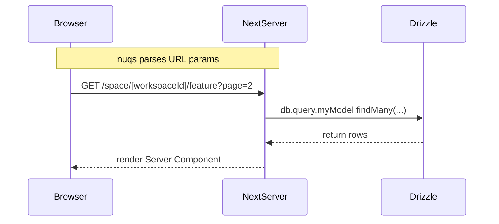
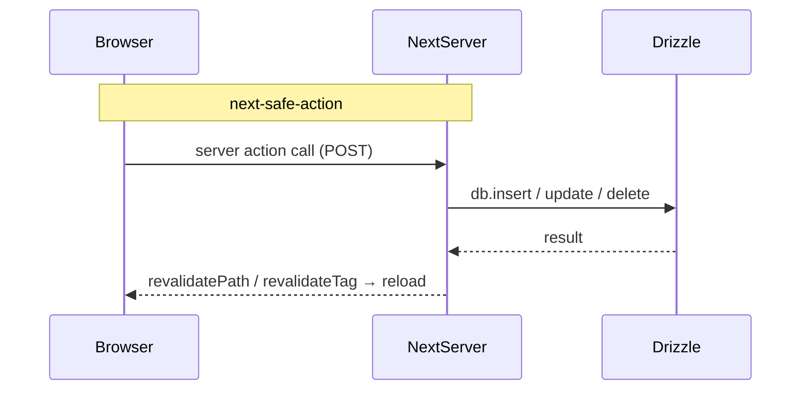
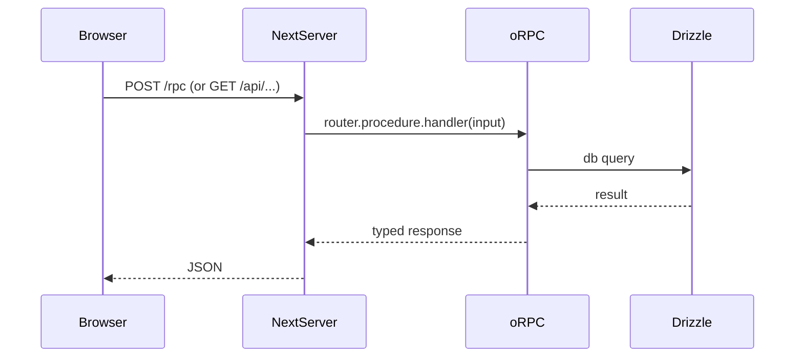
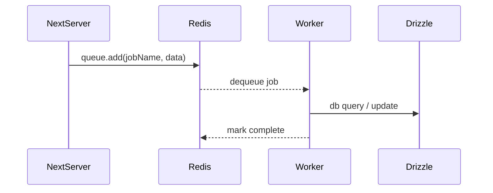
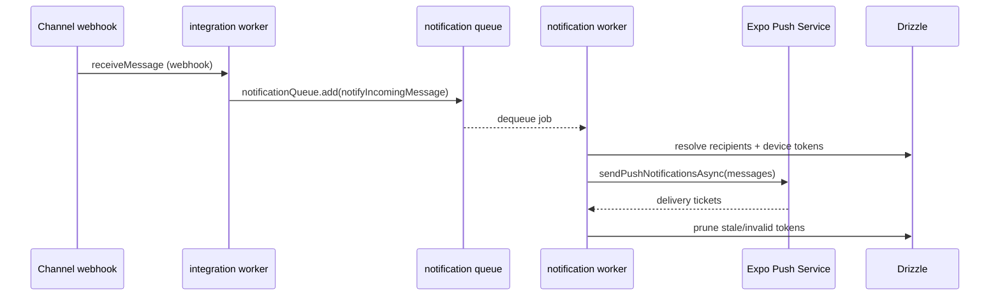

# Request workflows

### GET Requests (Server Component)

### Mutations via Server Actions (next-safe-action)

### API Requests via oRPC

### Background Jobs (BullMQ)

### Push Notifications (inbound message → Expo)

See `docs/push-notifications.md` for the full architecture, recipient
resolution, and the `EXPO_PUSH_ENABLED` kill switch.
